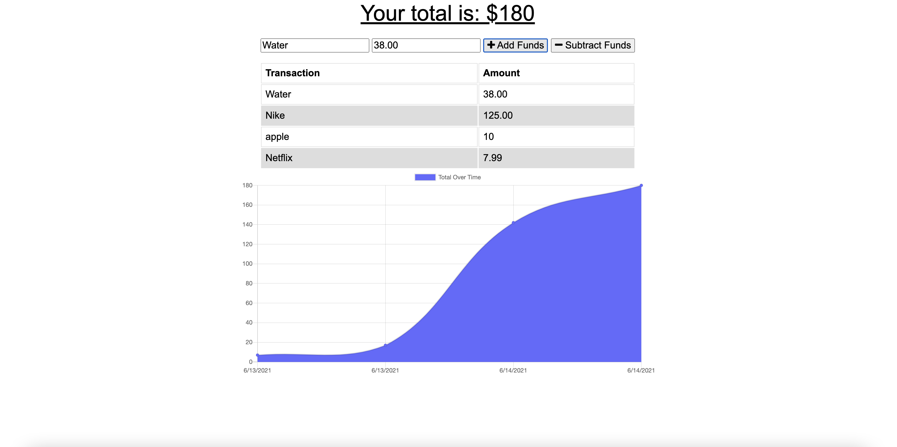

# budget_tracker

## Introduction
This Budget Tracker Application is built to allow users to track their monthly spending. Thay can add and remove funds and see a graph that shows them their monthly spending.

## Installation
How to install this application:
-Run npm install
-then run npm start
If Successful, the app will tell you "APP running on port 3000!"
If needed, you can change the port number in the server.js.

## License
This project is licensed under MIT

## Example

## Deployed Application
